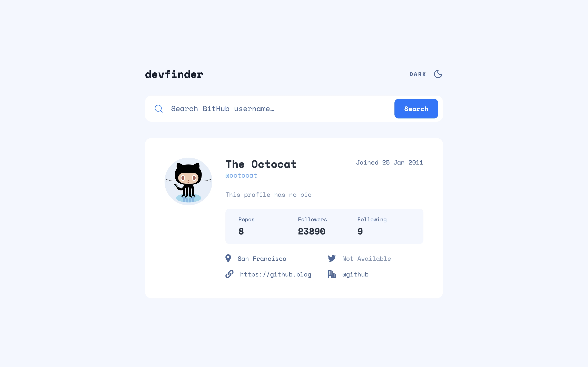
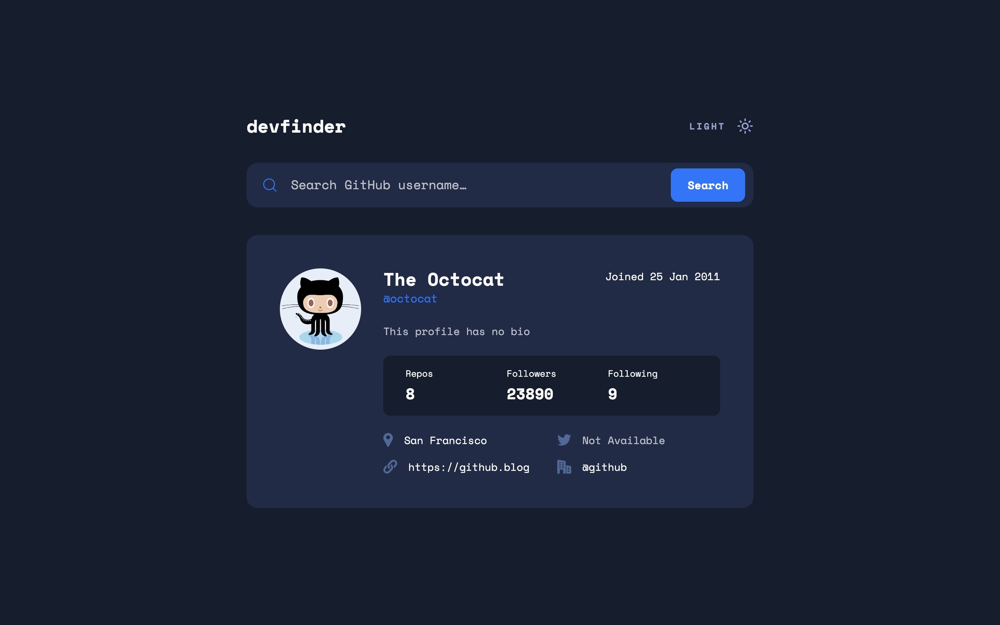
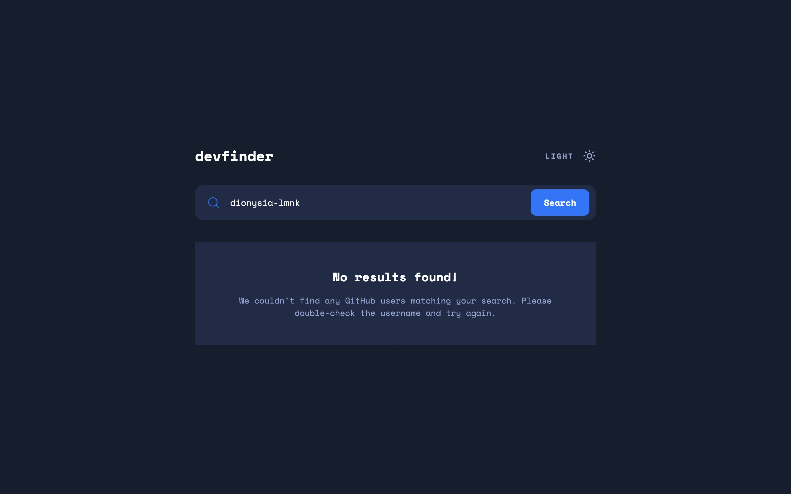

# Frontend Mentor - GitHub User Search App

A GitHub user search app built with React, TypeScript, Zod, and TanStack Query, focused on a data validation and a typed API layer.

## 🔗 Links

Live site: [View Live](https://github-user-search-app-dionysialemonaki.vercel.app/)

## ✅ Acceptance Criteria

Users should be able to:

- Search for GitHub users by their username
- See relevant user information based on their search
- Switch between light and dark themes
- View the optimal layout for the app depending on their device's screen size
- See hover and focus states for all interactive elements on the page
- Have the correct color scheme chosen for them based on their computer preferences

## 📸 Screenshots

Light theme:



Dark theme:



No results found:



## 🏗️ Built With

- React
- TypeScript
- TanStack Query
- Zod
- Tailwind CSS
- Vite

## 🎨 What I focused on

### Validating the API's shape

`fetch` can only tell you a request succeeded — it can't tell you the response actually matches the shape your app expects. `getUser` treats those as two separate concerns: HTTP failure and shape failure both throw, but for different reasons, and nothing downstream ever has to guard against malformed data, because by the time this function returns, the data has already been checked against `githubUserSchema`.

```ts
export const getUser = async (username: string): Promise<GithubUser> => {
  const response = await fetch(`${BASE_URL}/users/${username}`);

  if (!response.ok) {
    if (response.status === 404) {
      throw new Error("User not found");
    }
    throw new Error("Network response was not ok");
  }

  const data = await response.json();
  const result = githubUserSchema.safeParse(data);

  if (!result.success) {
    throw new Error("Invalid API response shape");
  }

  return result.data;
};
```

Every failure path throws, and every success path returns a value the schema has already narrowed to `GithubUser` — no `null`, no `undefined`. That one consistency decision is what lets `useGithubUser` stay a thin wrapper around `useQuery`: TanStack Query's `error` and `data` fields work exactly as intended.

### A schema that models the API

Writing this schema meant checking real API responses rather than guessing field types. GitHub returns `null` for some missing fields (`bio`, `location`, `company`) but an empty string for others (`blog`) — two different absent-value conventions in the same object, and the schema reflects that distinction instead of flattening it:

```ts
export const githubUserSchema = z.object({
  avatar_url: z.url(),
  name: z.string().nullable(),
  login: z.string(),
  created_at: z.string(),
  bio: z.string().nullable(),
  public_repos: z.number(),
  followers: z.number(),
  following: z.number(),
  location: z.string().nullable(),
  blog: z.union([z.literal(""), z.url()]),
  twitter_username: z.string().nullable(),
  company: z.string().nullable(),
});

export type GithubUser = z.infer<typeof githubUserSchema>;
```

The type is inferred from the schema with `z.infer`, so the validation rules and the TypeScript type can never drift out of sync with each other.

### One hook, thin on purpose

`useGithubUser` doesn't add logic on top of `useQuery` — it exists to give the query a name, a key, and a single opinion about retries.

```ts
export const useGithubUser = (username: string) => {
  return useQuery({
    queryKey: ["users", username],
    queryFn: () => getUser(username),
    retry: false,
  });
};
```

`retry` is set to `false` deliberately: a 404 for a bad username will never succeed on a second attempt, so retrying by default would only delay the "no results" state the user is waiting on for no benefit.

### Theme state that survives a refresh and respects the OS first

The initial theme is resolved in a specific order: an explicit choice the user already made, stored in `localStorage`, wins over the operating system's preference — but the OS preference is still the fallback for a first-time visitor, satisfying the `prefers-color-scheme` requirement.

```ts
const getInitialTheme = (): Theme => {
  const stored = localStorage.getItem("theme");
  if (stored === "light" || stored === "dark") {
    return stored;
  }
  return getSystemTheme();
};

const [theme, setTheme] = useState(getInitialTheme);
```

Passing `getInitialTheme` itself to `useState`, means the function only runs once on mount instead of on every re-render.

### An accessible search field with no extra dependencies

The search input pairs a `useId()`-generated id with a visually hidden `<label>`, so the field has a real accessible name beyond its placeholder — and it's a real `<form>`, so pressing Enter submits the search the same way clicking the button does.

```tsx
const id = useId();

<label htmlFor={id} className="sr-only">
  Enter GitHub username
</label>
<input id={id} value={input} onChange={onInputChange} required />
```

## Credits

Design from [Frontend Mentor](https://www.frontendmentor.io/challenges/github-user-search-app-Q09YOgaH6). Icons from [Lucide](https://lucide.dev/).
